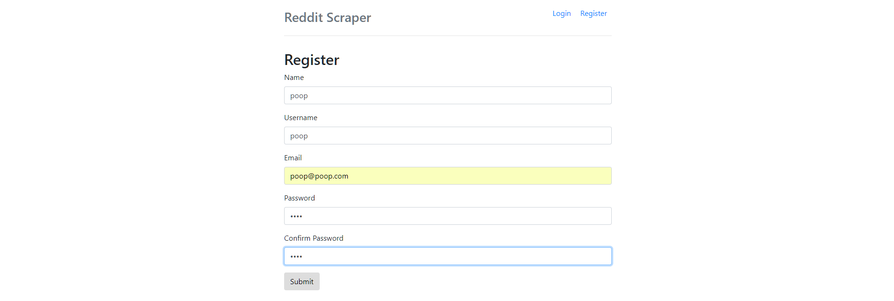

# Reddit Scraper

Here is a reddit scraper that allows people to register, login, and save their favorite reddit threads and to make personal comments/notes on each thread. This adds a new level of functionality that reddit doesn't have in their saved threads by allowing you to make a personal note on a thread. This concept can easily be applied to incorporate all news/sites that can be scraped and allow a user to save links and make notes on those links. This can be potentially useful to researchers/journalists who favorite/save a lot of things but also want notes to remind them as to why they saved it.

## Demo

Go to this link:
[https://gentle-temple-67737.herokuapp.com/](https://gentle-temple-67737.herokuapp.com/)

### Register

The register system lacks email confirmation but it does check if a username or email is already in use.

### Login

You can then log in via the login button at the top.

### Scraper

Here you can add a subreddit and select a subreddit to scrape. You can favorite a reddit thread by clicking on the heart under each thread.

### Dashboard

Finally, go back to the dashboard to add comments your favorite.

### Future Implementation

There is actual potential for this concept to be turned into a full application. Here is a list of features that would be needed.

* Styling (almost no styling was done for this)
* Commenting on scraper page
* Include all comments for each favorite in a single modal to allow editing
* Delete subreddits added
* Sort favorites by subreddit, descending, alphabetically, and more
* More favorite editing including title and url
* Share your favorites with other people
* Sort subreddits by hot, new, top(sort by time), controversial(sort by time)
* Add more websites like NYT, WaPo, Voat, etc.
* Add ability for user to custom input a URL and comments for that favorite
* Turn this into a mobile app where it would be most useful